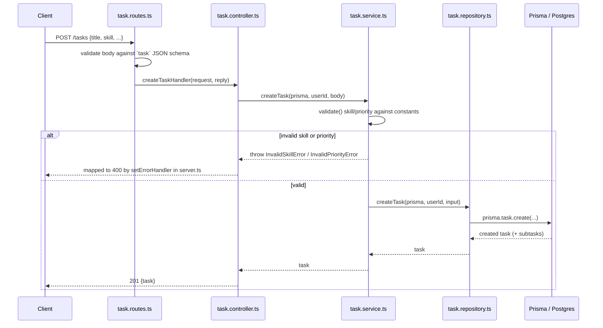

# CLAUDE.md

This file provides guidance to Claude Code (claude.ai/code) when working with code in this repository.

## Commands

Run from `src/backend/`:

- `npm run dev` — start the server with hot reload (`tsx watch src/server.ts`)
- `npm run build` — compile TypeScript to `dist/` via `tsc`
- `npm run start` — run the compiled server from `dist/server.js`
- `npm run lint` / `npm run lint:fix` — ESLint over the project
- `npm run format` / `npm run format:check` — Prettier
- `npm run prisma:generate` — regenerate the Prisma client (output goes to `src/generated/prisma`, not `node_modules`)
- `npm run prisma:migrate` — create/apply a dev migration from `prisma/schema.prisma`
- `npm run prisma:studio` — open Prisma Studio

There is no test suite configured yet (`npm test` is a placeholder).

A `.env` file is required (see `.env.example`): `DATABASE_URL`, `JWT_SECRET`, `JWT_EXPIRES_IN`, `PORT`, `HOST`, `CORS_ORIGIN`. `src/config/env.ts` throws at startup if `DATABASE_URL` or `JWT_SECRET` are missing.

## Architecture

Fastify 5 + PostgreSQL via Prisma. Layered structure, one folder per concern under `src/`:

```
routes/       Fastify route registration + JSON schema validation
controllers/  Request/reply handling — parses request, calls a service, maps errors to HTTP status codes
services/     Business logic; throws typed errors (e.g. EmailAlreadyInUseError) that controllers catch
repositories/ Prisma queries only — no business logic
types/        Shared input/DTO types
plugins/      Fastify plugins registered in server.ts (e.g. plugins/prisma.ts decorates `fastify.prisma`)
config/       Env loading (config/env.ts) and the Prisma client instance (config/prisma.ts)
generated/    Prisma client output — do not edit, regenerate via `npm run prisma:generate`
```

Request flow: `server.ts` registers plugins and routes → a route file wires an HTTP method+path to a controller with a JSON schema for the body → the controller calls a service function, passing `request.server.prisma` → the service calls repository functions and throws domain-specific error classes on failure → the controller catches those specific error classes and maps them to HTTP responses; unknown errors are rethrown to Fastify's default error handling.

When adding a new resource, follow the same four-layer split (route → controller → service → repository) rather than putting logic directly in route handlers.

Concrete example — `POST /tasks`:



Every other endpoint (`/auth/login`, `/auth/signup`, `/user/me`, `GET /tasks`) follows this same shape — swap the route/controller/service/repo file names and the error classes thrown.

Passwords are hashed with Node's built-in `crypto.scrypt` (see `src/utils/password.ts`) — there is no bcrypt/argon2 dependency, don't add one for this.

The Prisma client is generated to `src/generated/prisma` (custom `output` in `schema.prisma`), not the default `node_modules/.prisma`; import it from there (or via `src/config/prisma.ts`), and re-run `npm run prisma:generate` after schema changes.

## Related

This is the backend half of the "Task Timer & Productivity Analytics System" described in `src/frontend/CLAUDE.md` — a server-driven timer with recursive tasks/subtasks, productivity analytics, and an AI focus-validation layer. The Prisma schema now defines `User` and `Task` (self-referential `parent`/`subtasks` for recursion, `skill`/`priority` as strings validated against `src/constants/task.constants.ts` rather than DB enums); timer/analytics/AI-validation models described in the frontend doc are not yet implemented here.
